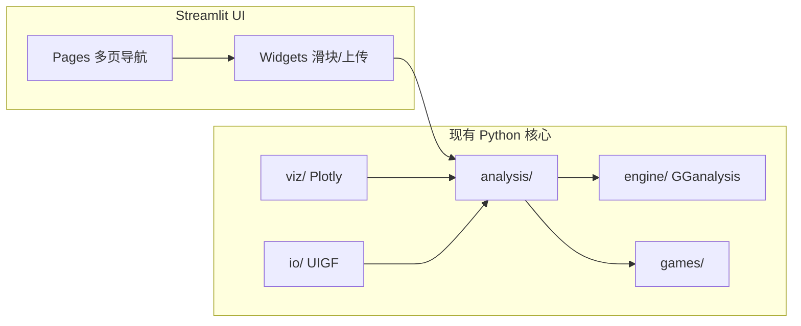

# Streamlit 交互应用设计（M5 预备）

> **状态**：设计文档 only，尚未实现。本文档为下一迭代 sprint 的可执行蓝图。

## 1. 「交互」在本项目中的含义

| 维度 | 当前 CLI + 静态产物 | Streamlit 交互应用 |
|------|---------------------|-------------------|
| 输入 | 命令行参数，改一次跑一次 | 滑块/开关实时改参，**无需重跑 shell** |
| 输出 | 终端文本 + PNG + 自包含 Plotly HTML | 同页内图表随参数 **即时刷新** |
| 组合 | `combine` / `grid` 需多次命令 | 单页勾选目标，联合分布一次呈现 |
| 历史 | `history --file` 一次性打印 | 上传 UIGF → 自动还原水位 → 滑块微调预测 |
| 受众 | 开发者 / 熟手 | 策划、内容创作者、普通玩家 |

**核心体验**：拖动「已垫抽数」「是否大保底」「连歪次数」「目标拷贝数」，立刻看到期望抽数、P90、预算把握、PMF/CDF 曲线变化——复用现有 `analysis/` + `viz/`，不重复造概率引擎。



## 2. 信息架构与导航

采用 **侧边栏全局导航 + 主内容区**，5 个一级页面，对应现有 CLI 子命令：

```
┌─────────────────────────────────────────────────────────────┐
│  gacha · 抽卡决策工具                    [游戏 ▼] [主题]   │
├──────────┬──────────────────────────────────────────────────┤
│ Analyze  │  ┌─ 状态 ─────────┐  ┌─ 目标 ─────────┐         │
│ Combine  │  │ pity [====]    │  │ copies [==]    │         │
│ Grid     │  │ □ 大保底       │  │ banner ○角色○武器│         │
│ History  │  │ losses [==]    │  └────────────────┘         │
│ Compare  │  └────────────────┘                              │
│          │  ┌─ 指标卡片 E[N] P50 P90 CVaR ─────────────┐   │
│          │  └───────────────────────────────────────────┘   │
│          │  ┌─ PMF / CDF 交互图 ─────────────────────────┐ │
│          │  │  (Plotly, st.plotly_chart)                │ │
│          │  └───────────────────────────────────────────┘   │
└──────────┴──────────────────────────────────────────────────┘
```

### 页面说明

| 页面 | 对应 CLI | 主要控件 | 输出 |
|------|----------|----------|------|
| **Analyze** | `analyze` | pity、guaranteed、losses、copies、banner、budget | 指标卡 + PMF/CDF + 预算表 |
| **Combine** | `combine` | 角色/武器独立水位 + 拷贝数 | 联合分布 + 分解对比条 |
| **Grid** | `grid` | max_const、max_refine、起始水位 | 热力图 + 可点击单元格详情 |
| **History** | `history` | UIGF 文件上传、uid 选择 | 还原水位 → 一键填入 Analyze |
| **Compare** | `compare` | 游戏多选、banner、copies | 柱状图 + 白嫖速率（CNY 折叠逻辑复用） |

## 3. 关键控件线框（Analyze 页）

```
┌────────────────────────────────────────────────────────────┐
│ 原神 · 角色活动祈愿                                         │
├────────────────────┬───────────────────────────────────────┤
│ 当前状态           │  期望 93 抽    P50 77    P90 165      │
│ ─────────────────  │  ───────────────────────────────────  │
│ 已垫抽数  [0━━━90] │         PMF ▁▂▃▅▇█▇▅▃▂▁               │
│ 大保底    [ OFF ]  │         CDF ────────────────▶          │
│ 连歪 0-3  [0━3]    │  ───────────────────────────────────  │
│ ─────────────────  │  预算 90 抽 → 把握 42%  运气分位 38%   │
│ 目标               │  [50%把握] [90%把握] [99%把握] 表     │
│ 拷贝数    [1━━7]   │                                       │
│ 池子      (●)角色  │  [可选] reference-MC 校验开关         │
└────────────────────┴───────────────────────────────────────┘
```

- **st.slider** / **st.toggle** / **st.selectbox** 绑定 `PullState` 与 `Target` 字段。
- 每次 widget 变更 → `solver.solve()` → `metrics.summary()` → `st.plotly_chart(pmf_cdf_figure(...))`。
- `@st.cache_data` 缓存 `(game, state_hash, target)` → `PullDistribution`，避免重复卷积。

## 4. 视觉风格

**方向**：干净的数据工具美学，**非游戏化**（无卡面、无粒子、无抽卡动画）。

| 元素 | 规范 |
|------|------|
| 配色 | 沿用 `viz/report.py`：蓝 `#3D6FE5`、绿 `#1F9E78`、琥珀 `#E8A317`、红 `#E4572E` |
| 字体 | 系统无衬线 + 中文 fallback（与 HTML 报告一致） |
| 背景 | 浅灰 `#F4F6FA` 页面 + 白卡片 `border-radius: 12px` |
| 图表 | Plotly only（不用 matplotlib 嵌入 Streamlit） |
| 密度 | 桌面优先：两栏布局；指标卡单行 4~6 个 |

## 5. 代码复用映射

| Streamlit 层 | 复用模块 |
|--------------|----------|
| 求解 | `GGanalysisSolver`（与 CLI 相同单例模式） |
| 指标 | `analysis.metrics`, `analysis.budget` |
| 组合/网格 | `analysis.combine`, `analysis.grid` |
| 跨游戏 | `analysis.compare`（含 `shared_money_per_pull_cny`） |
| 图表 | `viz.report.pmf_cdf_figure`, `grid_figure`, `comparison_figure` |
| 历史 | `io.uigf.load_uigf`, `io.history.analyze_character_history` |
| 游戏列表 | `games.registry.list_games`, `get_game` |

**新增代码预估**：`app/streamlit_app.py`（~300 行）+ `app/components/` 小组件（状态栏、指标卡、上传器），**不修改** `engine/base.py` 冻结接口。

## 6. MVP vs 后续（M5）

### MVP（第一 sprint，~3–5 天）

- [ ] Analyze 页：单游戏单 banner，实时 PMF/CDF + 指标卡
- [ ] Combine 页：角色+武器联合
- [ ] 侧边栏游戏切换（genshin / hsr / zzz）
- [ ] `st.cache_data` 性能兜底
- [ ] `streamlit run app/streamlit_app.py` 启动说明写入 README

### Later

- [ ] History 页 UIGF 上传 + 水位注入 Analyze
- [ ] Grid 页完整 C0–C6 × R0–R5
- [ ] Compare 页
- [ ] 导出 HTML 报告（复用 `viz.report.generate_report`）
- [ ] reference-MC 校验开关（仅原神角色池）
- [ ] 多账号 uid 切换

## 7. 移动端（nice-to-have）

Streamlit 默认响应式，但复杂热力图在手机上可读性差。

- MVP：**不专门适配**；侧边栏可折叠即可。
- Later：Analyze 页在 `st.session_state.viewport == narrow` 时改为单栏堆叠；Grid 改为下拉选择 (C, R) 而非热力图。

## 8. 启动与部署（预备）

```bash
pip install streamlit  # 加入 optional-dependencies.web
streamlit run app/streamlit_app.py
```

部署选项：Streamlit Community Cloud / 内网 Docker（只读、无账号体系即可）。

## 9. 验收标准

1. 拖动 pity 滑块，E[N] 与 CLI `gacha analyze --pity N` 一致（±0.01）。
2. 01 场景（C0 R1）Combine 页显示 ≈179.98 抽。
3. 无网络依赖（Plotly 内联或 streamlit 内置）。
4. 不新增游戏、不修改 GGanalysis 数值路径。
